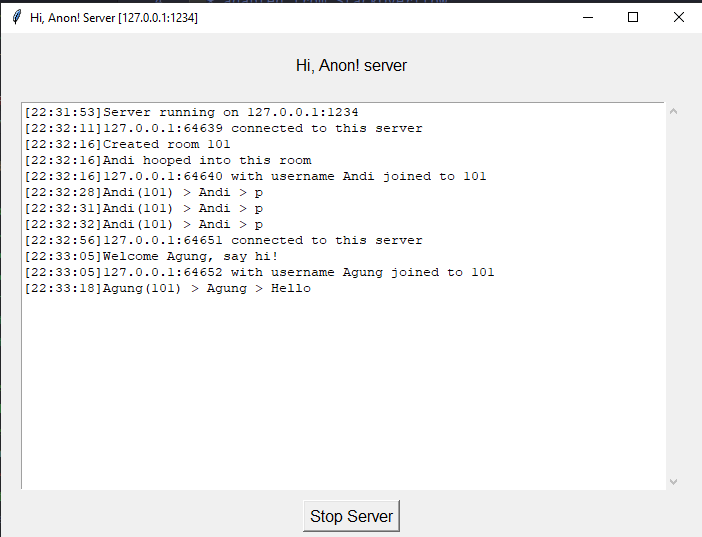
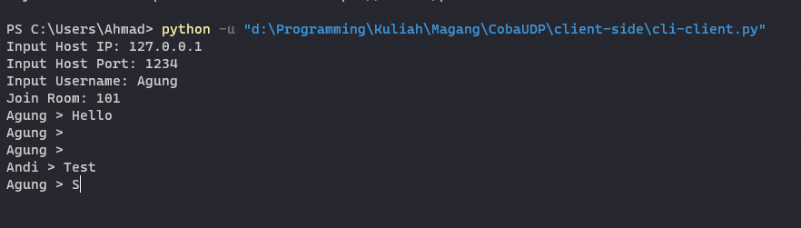
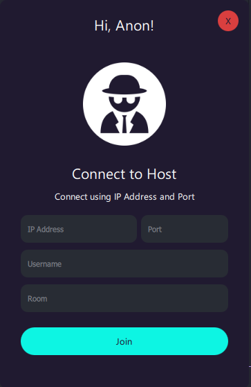
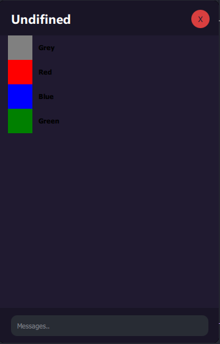

# Implementasi UDP: UDP Based Group Chat
<b>Nama:</b> Akhmad Thoriq Afif </br>
<b>NRP:</b> 5024201028 </br>
<b>Jurusan:</b> Teknik Komputer </br></br>
<i>Repositori ini dibuat untuk memenuhi tugas magang tim robotik ICHIRO ITS</i>
## Overview
Program ini berjudul <b><i>Hi, Anon!</i></b>. Merupakan sebuah program group chat dengan protokol UDP.

## Penjelasan Program
TODO

### Message Template
```json
{"method":str, "token":str, "username":str, "room":str, "msg":str}
```
+ __method__ </br>
  Sebagai penanda hal apa yang diminta oleh user, terdapat 4 method: CONNECT, LOGIN, LOGOUT, SEND
  | Method  | Fungsi                                                                                                                                                    |
  | ------- | --------------------------------------------------------------------------------------------------------------------------------------------------------- |
  | CONNECT | digunakan saat user pertama kali connect ke server. berfungsi sebagai validasi bahwa port sedang terbuka, method ini akan mengirimkan `token` kepada user |
  | LOGIN   | berfungsi saat user akan join ke dalam room. dalam method ini dibutuhkan key `token`, `username`, dan `room`                                              |
  | LOGOUT  | berfungsi ketika user keluar. Method `LOGOUT` ini akan menghapus user dari list user . Method ini membutuhkan '`token` dan `username`                     |
  | SEND    | berfungsi ketika user mengirimkan pesan ke user lain. Method ini membutuhkan `token`, `username`, dan `msg`                                               |

+ __token__ </br>
  Digunakan untuk memvalidasi tindakan user yang dikirimkan ke server. token ini dapat dibilang sebagai pengganti password.

+ __username__ </br>
  Digunakan sebagai identitas user.

+ __room__ </br>
  Digunakan saat user pertama kali join. Room ini berfungsi untuk memisah-misahkan chat

+ __msg__ </br>
  Berisi `string` yang akan dikirimkan ke user lain                                  |

## Alur Program
1. User mengirimkan method `CONNECT` kepada server dengan address yang telah diinputkan.
2. Server akan merespon dengan token. Token ini sebagai identitas unik yang dimiliki user. Selain identitas unik berfungsi juga untuk memvalidasi tindakan user.
3. User mengirimkan method `LOGIN` beserta `username`, `room` dan `token`. 
4. Server akan memasukkan user tersebut kedalam room jika room sudah ada. Jika belum room baru akan dibuat
5. User sudah dapat mengirimkan pesan.
6. Jika user ingin logout, user dapat melakukan `KeyboardInterupted` atau langsung mengclose program. Nantinya secara otomatis akan mengirimkan method `LOGOUT` ke server
## Usage
+ Server Side
    ```
    $ python3 server.py [-h] -l IP ADDRESS -p PORT [--no-gui]
      -h, --help        show help message
      -l IP ADDRESS     input server ip address (required)
      -p Port           input server port (required)
      --no-GUI          set interface to CLI mode (optional)
    ```
+ Client Side (CLI Mode)
    ```
    $ python3 cli-client.py
    ```
+ Client Side (GUI Mode)
    ```
    $ python3 gui-client.py
    ```
</br>

## Screenshot
+ Server GUI
    <p align="center">
    
    </p>
+ User CLI
    <p align="center">
    
    </p>
+ User GUI (In development)
  <p align="center">
    
    
    </p>